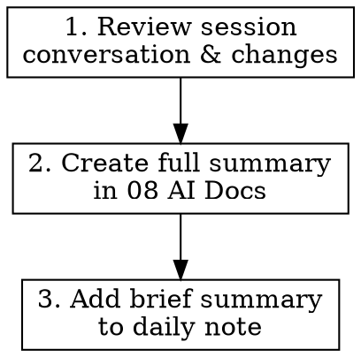

# Summarize Session

Create a comprehensive summary of the Claude Code session and store it in Obsidian, using the Obsidian skill.

## When to Use

- At the end of a productive coding session
- Before context gets too long and needs summarization
- When wrapping up significant work that should be documented

## Workflow



## Step 1: Review the Session

Analyze the conversation to identify:
- **Main objective** - What was the user trying to accomplish?
- **Key decisions** - Important choices made during the session
- **Files changed** - What code was modified or created?
- **Problems solved** - Bugs fixed, features implemented
- **Open items** - Anything left incomplete or for follow-up

## Step 2: Create Full Summary Note

Create a detailed summary note in `08 AI Docs`:

```bash
# Generate a descriptive filename based on the session topic
# Format: YYYY-MM-DD-topic-slug.md
NOTE_NAME="08 AI Docs/$(date +%Y-%m-%d)-session-topic"

obsidian-cli create "$NOTE_NAME" --content "..."
```

### Full Summary Template

```markdown
# Session Summary: [Brief Title]

**Date:** YYYY-MM-DD
**Duration:** Approximate session length
**Repository:** [repo name if applicable]

## Objective

[What the user was trying to accomplish]

## Key Accomplishments

- [ ] Accomplishment 1
- [ ] Accomplishment 2

## Technical Decisions

| Decision | Rationale |
|----------|-----------|
| Choice made | Why it was made |

## Journey & Iterations

Document the path taken to reach the solution, including dead ends:

### Approaches Tried

| Approach | Outcome | Learning |
|----------|---------|----------|
| First attempt | Why it didn't work | What we learned |
| Second attempt | Partial success | What improved |
| Final approach | Success | Why this worked |

### Key Pivots

- **Pivot 1:** Started with X, switched to Y because [reason]
- **Pivot 2:** Abandoned approach Z when [discovery]

### Dead Ends Worth Remembering

- Attempted [approach] but failed because [reason] - avoid in future
- [Tool/library] looked promising but [limitation discovered]

## Files Changed

- `path/to/file.ts` - Description of changes
- `path/to/another.ts` - Description of changes

## Code Snippets

[Include any particularly important code that was written]

## Problems Encountered

- Problem 1 and how it was resolved
- Problem 2 and current status

## Open Items / Follow-up

- [ ] Item for future work
- [ ] Question to investigate

## Related Resources

- Links to relevant docs, PRs, issues
```

## Step 3: Add to Daily Note

Add a brief summary to the daily note with a link to the full summary:

```bash
# Open/create today's daily note and append
obsidian-cli daily
```

### Daily Note Entry Template

```markdown
## Claude Code Session

**[[08 AI Docs/YYYY-MM-DD-session-topic|Session: Brief Title]]**

[1-2 sentence summary of what was accomplished]

Key outcomes:
- Outcome 1
- Outcome 2
```

## Quick Reference

| Element | Location | Purpose |
|---------|----------|---------|
| Full summary | `08 AI Docs/` | Complete documentation |
| Daily reference | Daily note | Quick access & timeline |
| Wikilink | Daily note | Navigation to full summary |

## Summary Quality Checklist

- [ ] Title is descriptive and searchable
- [ ] Objective is clearly stated
- [ ] All significant changes are documented
- [ ] Technical decisions include rationale
- [ ] Journey captures iterations and dead ends
- [ ] Learnings are extractable for future sessions
- [ ] Open items are actionable
- [ ] Daily note entry is concise (2-3 lines max)

## Common Mistakes

| Mistake | Fix |
|---------|-----|
| Too verbose | Focus on decisions and outcomes, not play-by-play |
| Missing context | Include repo name, branch, relevant links |
| No follow-up items | Always capture next steps |
| Broken wikilinks | Verify note path matches exactly |
| Only documenting success | Capture failed attempts and why they failed |
| Vague learnings | Be specific: "X doesn't work because Y" not "tried X" |

## Integration

Works well with:
- **obsidian** - Uses obsidian-cli for note creation
- **verification-before-completion** - Summarize after verifying work is complete