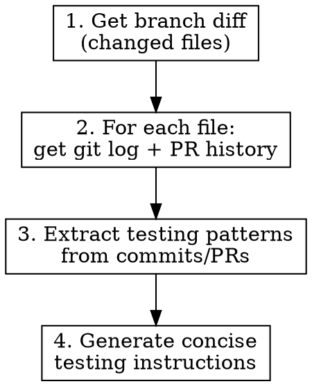

# Testing Plan from History

Generate concise testing instructions by analyzing git history and GitHub PRs for changed files.

## When to Use

- Before creating a PR that needs testing instructions
- When preparing QA notes for reviewers
- When you need to understand how to test unfamiliar code changes

## Workflow



## Step 1: Get Changed Files

```bash
# Get the base branch (main or master)
BASE=$(git symbolic-ref refs/remotes/origin/HEAD 2>/dev/null | sed 's@^refs/remotes/origin/@@' || echo "main")

# List changed files
git diff --name-only origin/$BASE...HEAD
```

## Step 2: Gather History for Each File

For each changed file, gather context:

```bash
# Recent commits touching this file (last 10)
git log --oneline -10 -- path/to/file

# PRs that modified this file (if gh cli available)
gh pr list --state merged --search "path/to/file" --limit 5 --json number,title,body
```

## Step 3: Extract Testing Patterns

Look for in commit messages and PR descriptions:
- **Test plan sections** - explicit testing instructions
- **Bug fix patterns** - "fixes #123" often has reproduction steps
- **Feature descriptions** - expected behavior to verify
- **Breaking changes** - areas needing regression testing

## Step 4: Generate Testing Instructions

Output format - keep it **concise**:

```markdown
## Testing Instructions

### Setup
- [ ] Prerequisites or environment setup

### Functional Tests
- [ ] Core functionality to verify
- [ ] Edge cases from bug fix history

### Regression Tests
- [ ] Related features that might be affected
```

## Quick Reference

| Source | What to Extract |
|--------|----------------|
| Commit messages | What changed and why |
| PR descriptions | Test plans, context, related issues |
| PR comments | Edge cases reviewers found |
| Issue references | Bug reproduction steps |

## Common Mistakes

| Mistake | Fix |
|---------|-----|
| Too verbose | Bullet points, not paragraphs |
| Missing setup | Always include prerequisites |
| Only happy path | Include edge cases from history |
| Copying PR verbatim | Synthesize into actionable steps |

## Example Output

```markdown
## Testing Instructions

### Setup
- [ ] Enable feature flag `new_checkout_flow`
- [ ] Have test account with saved payment method

### Functional Tests
- [ ] Complete checkout with new flow
- [ ] Verify order confirmation email sent
- [ ] Check order appears in admin

### Regression Tests
- [ ] Guest checkout still works (PR #234 context)
- [ ] Discount codes apply correctly
```

## Integration

Works well with:
- **superpowers:finishing-a-development-branch** - generate test plan before PR
- **superpowers:requesting-code-review** - include test plan in review request
